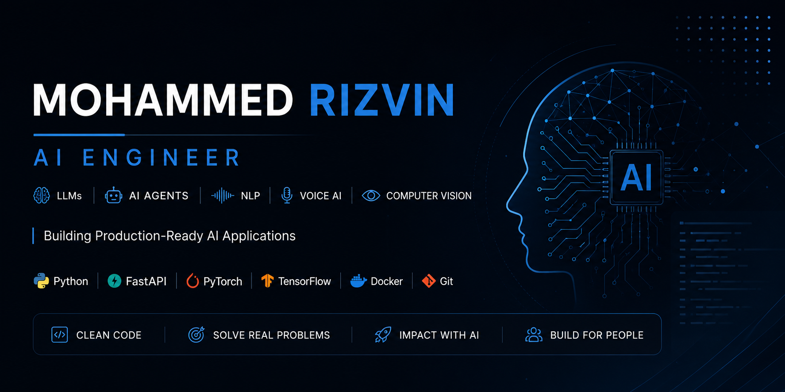

  

<h1 align="center">Mohammed Rizvin</h1>

<h3 align="center">
AI Engineer • Building AI Applications with LLMs, AI Agents, Voice AI & Computer Vision
</h3>

Building practical AI applications using Large Language Models, Voice AI, OCR, and modern backend technologies to solve real-world problems.

Open to AI Engineering opportunities in World wide and Remote.

---

## 👨‍💻 About Me

I'm an AI Engineer focused on building practical AI applications powered by Large Language Models, AI Agents, Speech AI, Computer Vision, and modern backend technologies.

My projects solve real-world challenges in healthcare, multilingual communication, and intelligent automation, with an emphasis on clean architecture, scalable APIs, and user-centered design.

I enjoy taking AI ideas from concept to deployment by combining intelligent models with reliable backend systems and intuitive user experiences.

---

## 🚀 Current Focus

- 🤖 AI Agents & LLM-powered Applications
- 📚 Retrieval-Augmented Generation (RAG)
- 🎙️ Voice AI & Speech Recognition
- 📄 OCR & Document Intelligence
- 🏥 Healthcare AI Solutions
- ⚡ FastAPI, Docker & Scalable Backend APIs

## 🚀 Selected AI Engineering Projects

### 🧠 [ORMA AI](https://github.com/rzvn6660/orma-ai)

An AI-powered memory assistant designed for elderly care, combining multilingual voice interaction, medication reminders, OCR, and intelligent caregiver support to improve daily independence and communication.

**Tech Stack:** Python • FastAPI • LLMs • Voice AI • OCR • Docker

---

### 💊 [Medi-fy](https://github.com/rzvn6660/Medi-fy)

An AI-powered medicine label intelligence platform that leverages OCR and Large Language Models to extract, interpret, and explain medication information in a simple and accessible way.

**Tech Stack:** Python • OpenCV • EasyOCR • LLMs • FastAPI

---

### 🌍 TREIM AI ([Repository](https://github.com/rzvn6660/Multilingual-AI))

A multilingual AI platform focused on breaking language barriers through intelligent translation and communication. TREIM AI includes an interactive Hugging Face Space, allowing users to experience multilingual AI capabilities directly in the browser.

🌐 **Live Demo : https://huggingface.co/spaces/rzvn1/TRIEM_

**Tech Stack:** Python • Hugging Face Transformers • FastAPI • NLP

---

### 🌐 [AI Portfolio](https://github.com/rzvn6660/Rizvin_Portfolio)

A modern portfolio showcasing AI engineering projects, technical expertise, certifications, and practical work in Generative AI, NLP, and intelligent systems.

**Tech Stack:** React • JavaScript • CSS

## 🛠️ Tech Stack

  

### 🤖 AI Engineering
- Large Language Models (LLMs)
- AI Agents
- Retrieval-Augmented Generation (RAG)
- Prompt Engineering
- Hugging Face Transformers
- LangChain
- Scikit-learn

### 🎙️ Speech AI
- Whisper
- Coqui TTS
- Speech Recognition
- Text-to-Speech (TTS)

### 👁️ Computer Vision
- OpenCV
- EasyOCR
- Image Processing

### ⚡ Backend Development
- FastAPI
- REST APIs
- Python Backend Development

### 🗄️ Databases
- PostgreSQL
- SQLite

### 🛠️ Development Tools
- Docker
- Git
- GitHub
- Linux
- VS Code

---

## 🌱 Currently Exploring

- 🤖 Multi-Agent AI Systems
- 📚 Retrieval-Augmented Generation (RAG)
- 🔌 Model Context Protocol (MCP)
- ⚙️ Production AI Deployment
- 🌍 Open Source AI

---

## 🤝 Let's Connect

---

*"Building intelligent AI systems that transform real-world challenges into practical, scalable solutions."*

